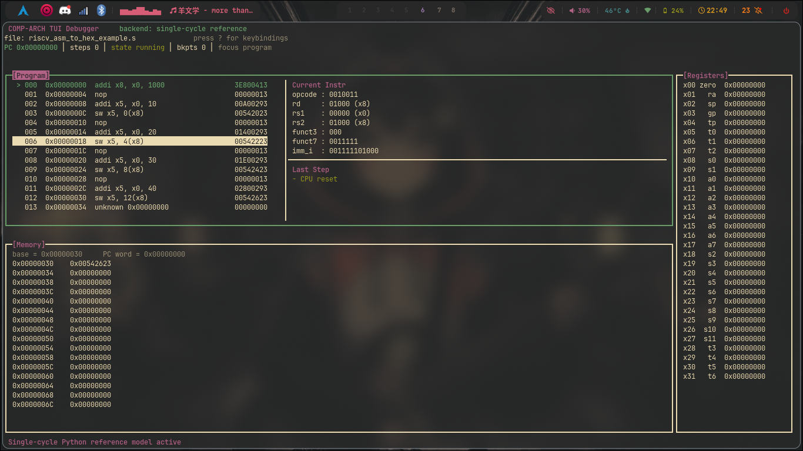

# riscy


`riscy` is a terminal UI debugger for small RISC-V programs, focused on studying and debugging the processors built in a computer architecture course.

It can load assembly or hex programs, execute them instruction by instruction on a Python reference model, and show the architectural state (PC, registers, memory, decoded fields) in a compact terminal UI with breakpoints and step controls.



## Features

- Loads `.s` and `.asm` files and assembles them through `tools/riscv_asm_to_hex.py`
- Loads `.txt` and `.hex` files containing 32-bit instruction words
- Executes programs on a Python **single-cycle reference model**
- Displays:
  - current `PC`
  - current instruction
  - decoded instruction fields
  - register file contents
  - memory contents
  - effects of the last executed instruction
- Supports step-by-step execution and short runs
- Uses only Python standard library modules

## Motivation

The course workflow often requires writing a small assembly test, converting it to hex, running the processor, and then manually checking registers and memory. This debugger shortens that loop by providing a lightweight way to inspect the architectural state directly.

The current focus is architectural visibility:

- instructions
- `PC`
- registers
- memory
- decoded instruction fields

It is not yet a Verilog waveform replacement or a direct HDL simulator frontend.

## Current Scope

The current backend models **single-cycle architectural behavior** in Python. It is designed as the first execution model in a larger roadmap that can later include:

- a multicycle Python backend
- a pipelined Python backend
- a project-connected backend that integrates more directly with the HDL flow

## Supported Instructions

The current single-cycle backend supports this subset:

- `lw`
- `addi`
- `slli`
- `xori`
- `srli`
- `srai`
- `ori`
- `andi`
- `sw`
- `add`
- `sub`
- `sll`
- `slt`
- `slti`
- `xor`
- `srl`
- `sra`
- `or`
- `and`
- `lui`
- `beq`
- `bne`
- `blt`
- `bge`
- `jalr`
- `jal`
- `nop`

## Requirements

- Python 3.10 or newer
- A terminal with `curses` support

No third-party Python packages are required.

## Installation

No installation step is required beyond having Python available.

```bash
git clone git@github.com:stiffis/riscy.git
cd riscy
```

## Usage

Run the debugger from inside the repository:

### Run with an assembly file

```bash
python3 app.py tools/riscv_asm_to_hex_example.s
```

### Run with a hex file

```bash
python3 app.py path/to/program.txt
```

The module form also works when running from the parent directory:

```bash
python3 -m riscy.app riscy/tools/riscv_asm_to_hex_example.s
```

## Controls

- `s`: execute one instruction
- `n`: execute 10 instructions
- `c`: continue (run until the next breakpoint or until the CPU halts)
- `g`: run to end (run until the CPU halts, with a safety step limit)
- `t`: run to the cursor line (run until the `PC` reaches the selected line)
- `b`: toggle a breakpoint at the **cursor** line in the Program panel
- `r`: reset CPU and memory
- `Ctrl+h/j/k/l`: move window focus (Program / Memory / Registers)
- `j` / `k`: scroll the focused window (Program cursor, Memory, or Registers)
- `p`: recenter the focused window on the current `PC`
- `?`: toggle the keybindings help overlay
- `q`: quit

The focused window is highlighted with a cyan border. Breakpoints are shown with
a `●` marker in the Program panel, and the selected line is highlighted. `continue`,
`run to end`, and `run to cursor` all stop on a safety step limit so an infinite
loop cannot hang the UI.

## Interface Overview

The UI currently shows four main areas:

- **Program**: nearby instructions, current instruction highlight, decoded fields, and last-step summary
- **Registers**: all 32 integer registers in a vertical view
- **Memory**: a word-oriented memory window
- **Status/Header**: current `PC`, step count, and CPU state

## Project Structure

```text
riscy/
├── __init__.py
├── app.py                  # curses TUI
├── asm_loader.py           # loads .s/.asm/.txt/.hex inputs
├── reference_cpu.py        # instruction semantics and core helpers
├── single_cycle_cpu.py     # single-cycle backend wrapper
├── assets/
│   └── screenshot.png
├── tests/
│   └── test_reference_cpu.py
├── tools/
│   ├── riscv_asm_to_hex.py          # assembler used by the TUI
│   └── riscv_asm_to_hex_example.s   # example program
└── README.md
```

## Tests

```bash
python3 -m unittest discover -s tests
```

## Design Notes

- The UI is implemented with `curses` to avoid external dependencies.
- The current backend is intentionally a Python architectural model instead of a direct Verilog interface.
- This keeps the debugger fast to start, easy to run on any lab machine, and useful for studying even before HDL integration.

## Limitations

- This is not yet connected directly to the `week12` / `week13` Verilog processors.
- It does not show internal HDL signals, waveform data, or pipeline hazard behavior.
- The assembler intentionally supports a restricted course-oriented subset rather than a full GNU assembler feature set.
- It does not currently model data sections such as `.word`, `.data`, or `.text`.

## Roadmap

Planned or likely next steps:

- add a multicycle Python backend
- add a pipelined Python backend
- add a project backend tied more directly to the HDL workflow
- improve program navigation and memory views
- expand assembler conveniences only when they match the course workflow

## Contributing

This tool is currently course-project oriented, so changes should prioritize:

- compatibility with the current RISC-V subset used in the repo
- low setup cost
- clarity for debugging and studying architecture concepts
- small, understandable changes over large framework-heavy rewrites

## License

`riscy` is free software, licensed under the GNU General Public License v3.0.
See the [LICENSE](LICENSE) file for the full text.
